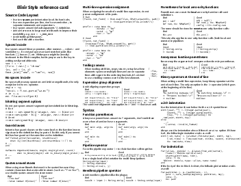
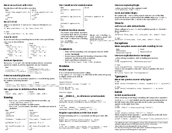

---
---

## Elixir Style reference card

This reference card is an adaptation of the [Elixir Style Guide][1] by Aleksei Magusev and other contributors. Please send suggestions via [GitHub issues][2]

PNG images of the reference sheet:

### Download

[PDF](elixir-style-refcard.pdf) (US letter) |
[PDF](elixir-style-refcard-a4.pdf) (A4) |
[LaTeX](elixir-style-refcard.tex)

### License

 This work is licensed under a <a rel="license" href="http://creativecommons.org/licenses/by/4.0/">Creative Commons Attribution 4.0 International License</a>.

[1]: https://github.com/lexmag/elixir-style-guide
[2]: https://github.com/milmazz/elixir-style-refcard/issues
